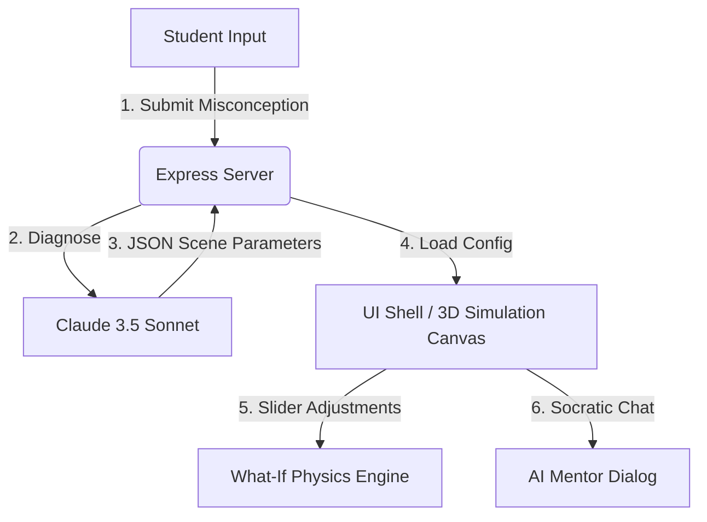

# NovaMind XR — AI Reality Composer for Science Education

NovaMind XR is an interactive, AI-powered 3D/WebXR educational platform designed to diagnose and resolve student science misconceptions through immersive Socratic "What-If" simulations.

## What NovaMind XR Does

The platform composed of three main capabilities:
1. **AI Cognitive Diagnosis:** Instantly analyzes student confusion statements and designs a customized 3D lab environment.
2. **Interactive 3D "What-If" Labs:** Allows students to adjust physics variables (gravity, mass, time-flow) in real time to visually explore concepts and see force vectors update.
3. **AI Socratic Mentor:** An integrated dialog companion that guides students using inquiry-based learning instead of giving direct answers.
4. **Cognitive Index Dashboard:** A real-time radar chart analyzing the student's spatial, conceptual, and logical understanding.

---

## Project Architecture

